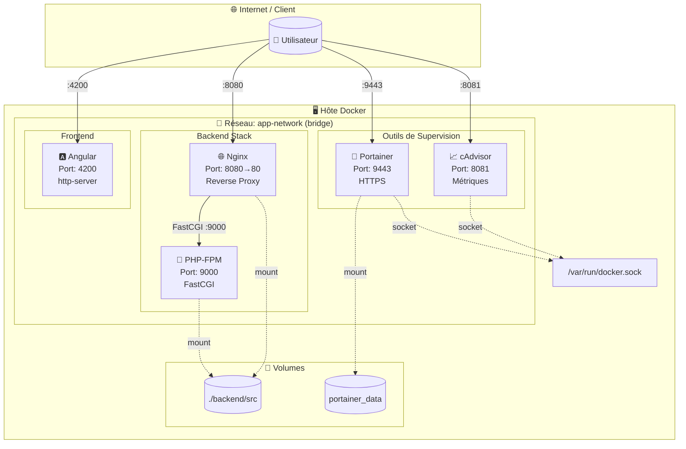
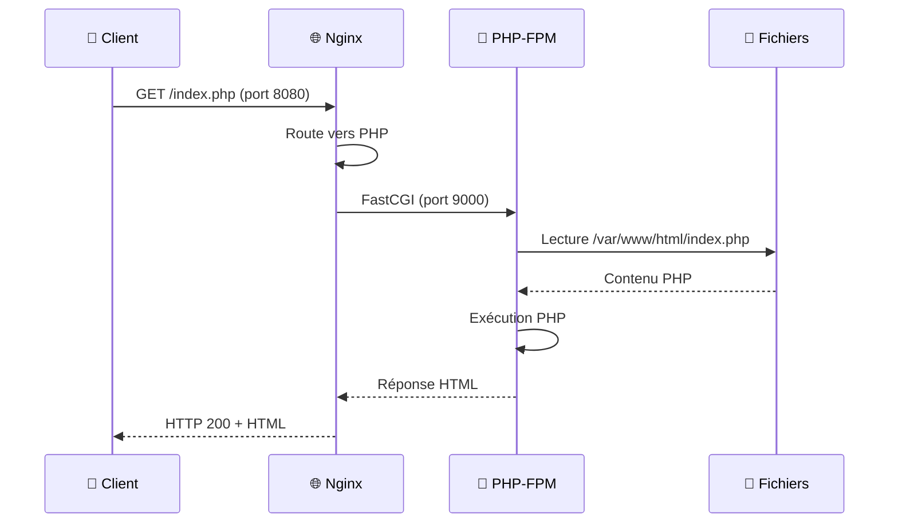
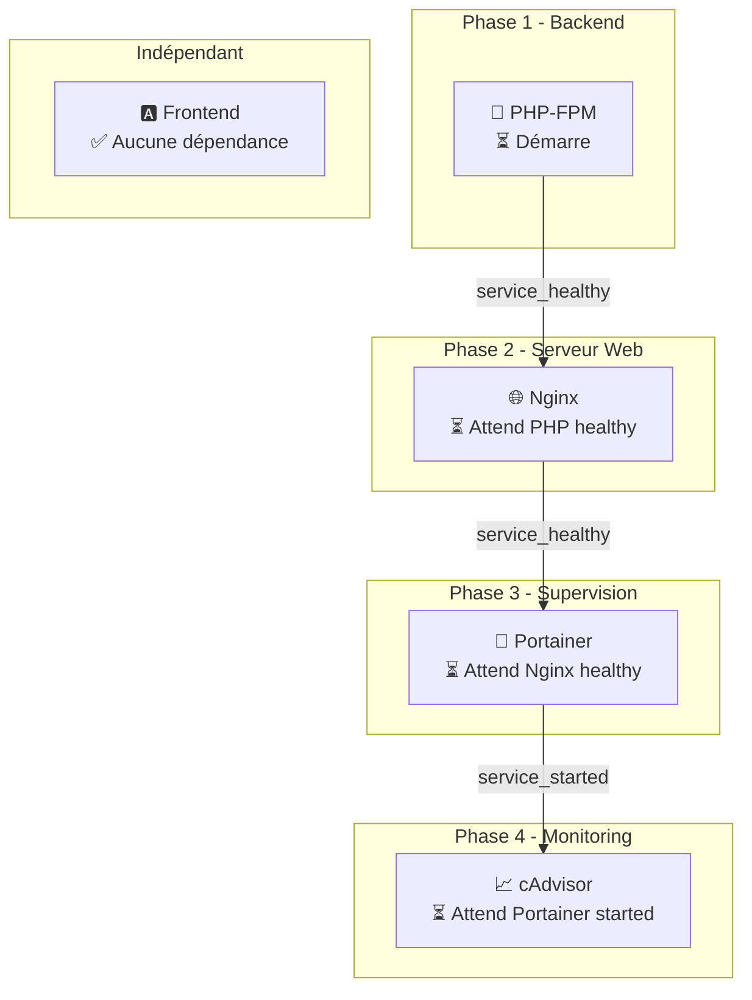
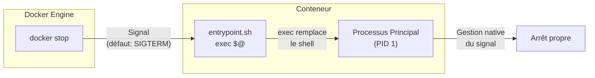
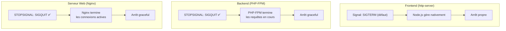
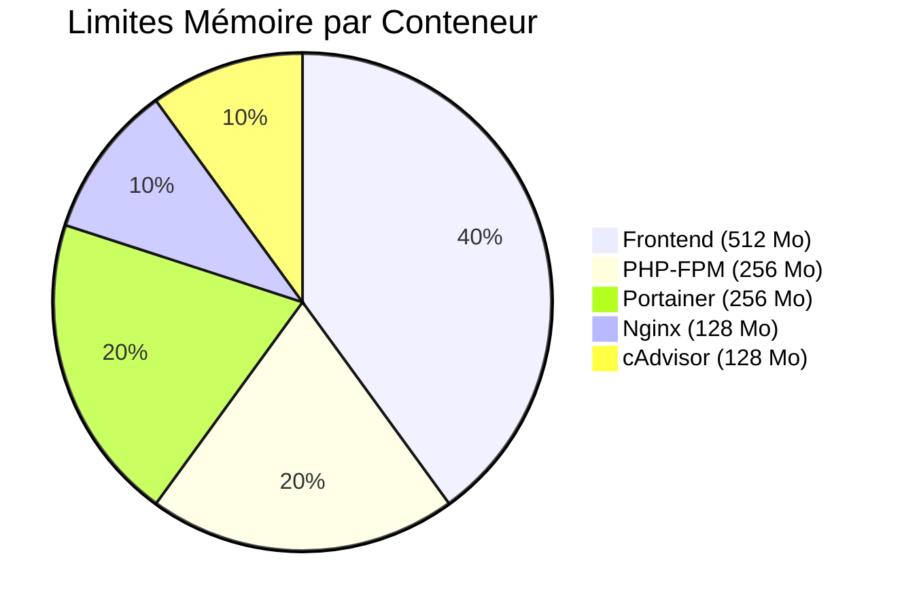
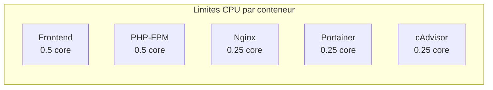
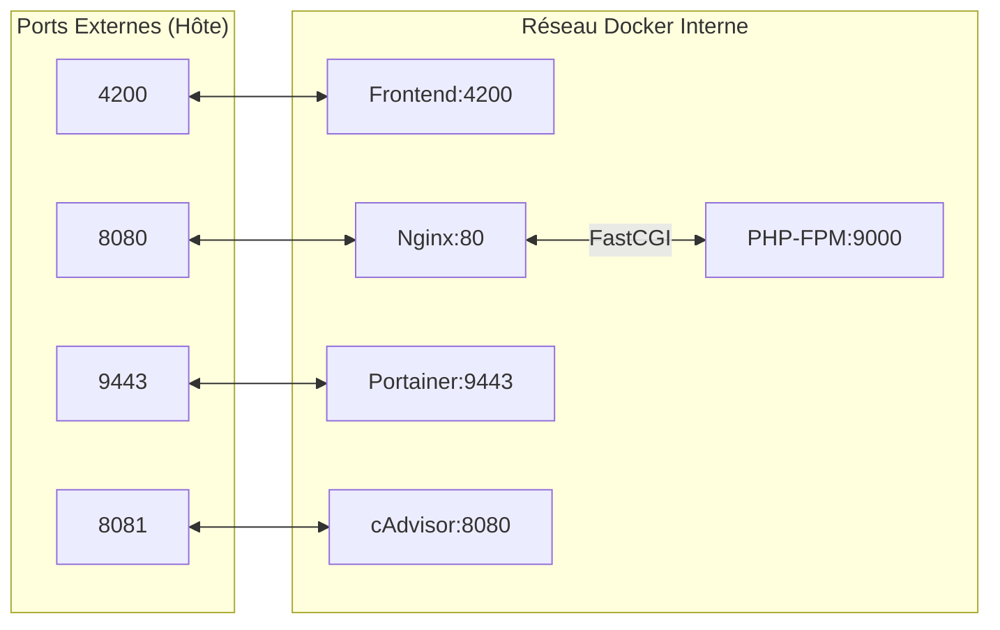

# 📊 Schéma d'Architecture - DevForDocker

Ce document présente les **schémas visuels** d'architecture du projet au format Mermaid (compatible GitHub, GitLab, etc.).

> 📖 **Pour la documentation complète** (explications détaillées, dépendances, arguments, justifications), voir [README.md](README.md).

*Présenté par Mickael FERNANDEZ*

---

## Choix d'Architecture

### Pourquoi cette stack ?

| Composant | Choix | Alternatives possibles | Justification |
|-----------|-------|----------------------|---------------|
| **Frontend** | Angular + http-server | React, Vue, nginx | Angular CLI pour le build, http-server léger pour servir |
| **Backend** | PHP-FPM | Node.js, Python | PHP reste très répandu, FPM est performant |
| **Serveur Web** | Nginx | Apache, Caddy | Nginx excelle en reverse proxy et performance |
| **Supervision** | Portainer | Rancher, Kubernetes Dashboard | Léger et adapté pour Docker standalone |
| **Monitoring** | cAdvisor | Prometheus seul, Grafana | Métriques Docker natives, interface web incluse |

### Comparaison Ubuntu vs Alpine

La question du choix de l'image de base est cruciale en production. Voici une comparaison détaillée :

| Critère | Ubuntu 24.04 | Alpine Linux |
|---------|--------------|--------------|
| **Taille de base** | ~78 Mo | ~5 Mo |
| **Gestionnaire de paquets** | apt (dpkg) | apk |
| **Bibliothèque C** | glibc | musl libc |
| **Shell par défaut** | bash | ash (BusyBox) |
| **Support LTS** | 5 ans (→ 2029) | ~2 ans par version |
| **Communauté** | Très large | En croissance |

#### Avantages d'Ubuntu (notre choix)

| Avantage | Explication |
|----------|-------------|
| **Compatibilité maximale** | glibc est la bibliothèque C standard, tous les binaires précompilés fonctionnent sans problème |
| **Debugging facilité** | Outils de diagnostic complets (`strace`, `ltrace`, etc.) disponibles |
| **Documentation abondante** | Très bien documenté, nombreuses ressources en ligne |
| **Packages récents** | Ubuntu 24.04 inclut PHP 8.3, Nginx 1.24+ nativement |
| **Stabilité éprouvée** | LTS avec 5 ans de support et mises à jour de sécurité |

#### Avantages d'Alpine (alternative)

| Avantage | Explication |
|----------|-------------|
| **Taille d'image réduite** | ~5 Mo vs ~78 Mo pour Ubuntu, gain significatif en stockage et transfert |
| **Surface d'attaque minimale** | Moins de packages installés = moins de vulnérabilités potentielles |
| **Démarrage plus rapide** | Image plus petite = pull et démarrage plus rapides |
| **Optimisé pour les conteneurs** | Conçu dès le départ pour Docker et les microservices |

#### Inconvénients d'Alpine (pourquoi on ne l'utilise pas ici)

| Inconvénient | Impact |
|--------------|--------|
| **musl libc vs glibc** | Certains binaires précompilés (comme Portainer, cAdvisor) peuvent avoir des problèmes de compatibilité |
| **Packages moins nombreux** | Certains packages doivent être compilés manuellement |
| **Debugging plus difficile** | Outils de base limités (BusyBox), moins de verbosité par défaut |
| **Problèmes DNS potentiels** | musl gère DNS différemment, peut causer des problèmes avec certaines applications |
| **Performances variables** | musl peut être plus lent que glibc pour certaines opérations (allocation mémoire, threads) |

#### Comparaison des tailles d'images (estimées)

| Image | Avec Ubuntu 24.04 | Avec Alpine | Économie |
|-------|-------------------|-------------|----------|
| Frontend (Node.js) | ~450 Mo | ~150 Mo | ~67% |
| Backend (PHP-FPM) | ~250 Mo | ~80 Mo | ~68% |
| Nginx | ~180 Mo | ~25 Mo | ~86% |
| Portainer | ~280 Mo | ⚠️ Binaire glibc | N/A |
| cAdvisor | ~200 Mo | ⚠️ Binaire glibc | N/A |

> **Note** : Portainer et cAdvisor sont distribués en binaires compilés pour glibc. Les faire fonctionner sur Alpine nécessiterait d'installer `gcompat` (couche de compatibilité glibc) ou de recompiler depuis les sources.

#### Quand choisir Alpine ?

- ✅ Microservices légers avec peu de dépendances
- ✅ Applications Node.js ou Go pures (bien supportées sur musl)
- ✅ Environnements avec bande passante limitée (réduction du temps de pull)
- ✅ Besoin de réduire la surface d'attaque (sécurité)

#### Quand choisir Ubuntu ?

- ✅ Applications avec binaires précompilés (Portainer, cAdvisor)
- ✅ Stack PHP (meilleur support des extensions)
- ✅ Besoin d'outils de debugging avancés
- ✅ Équipe familière avec l'écosystème Debian/Ubuntu
- ✅ Support long terme et stabilité prioritaires

**Notre choix : Ubuntu 24.04** pour sa compatibilité universelle avec tous nos composants (binaires glibc de Portainer/cAdvisor) et le respect de la contrainte du projet (images construites depuis zéro).

---

## Architecture Globale

## Flux de Requêtes HTTP

## Ordre de Démarrage

## Gestion des Signaux

> 📖 **Explications détaillées** : voir [README.md - Gestion des Signaux](README.md#-gestion-des-signaux-darrêt)

### Stratégie par Service

## Ressources Allouées

> 📖 **Justifications détaillées** : voir [README.md - Justification des limites](README.md#justification-des-limites-de-ressources)

### Limites Mémoire

### Limites CPU

## Communication Inter-Services

---

## Visualisation

Pour visualiser ces schémas :

1. **GitHub/GitLab** : Les diagrammes Mermaid sont rendus automatiquement
2. **VS Code** : Installer l'extension "Markdown Preview Mermaid Support"
3. **En ligne** : Utiliser [Mermaid Live Editor](https://mermaid.live/)

---

## Voir aussi

- **[README.md](README.md)** : Documentation principale complète (images, dépendances, arguments, justifications des ressources, démarrage rapide)

---

*Schémas générés pour le projet DevForDocker - Février 2026*
