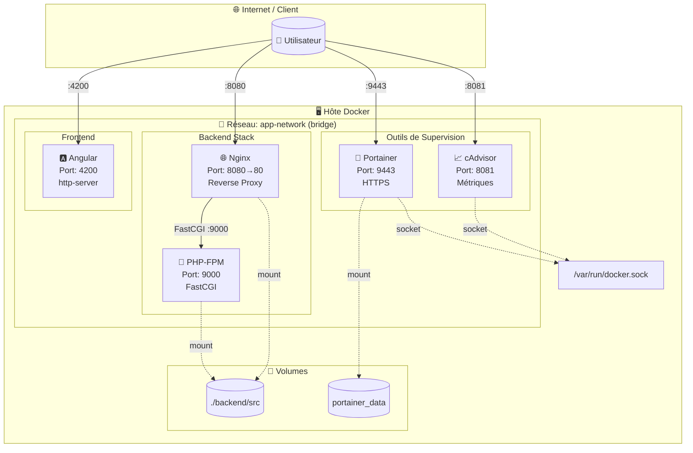
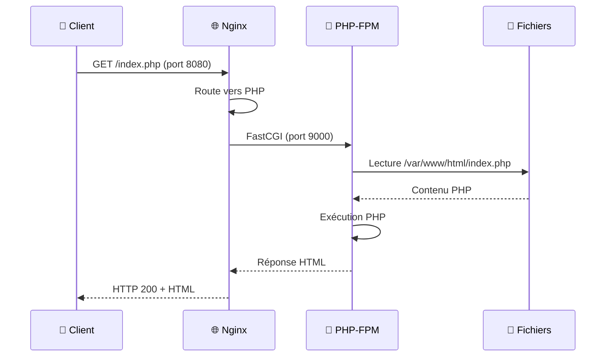
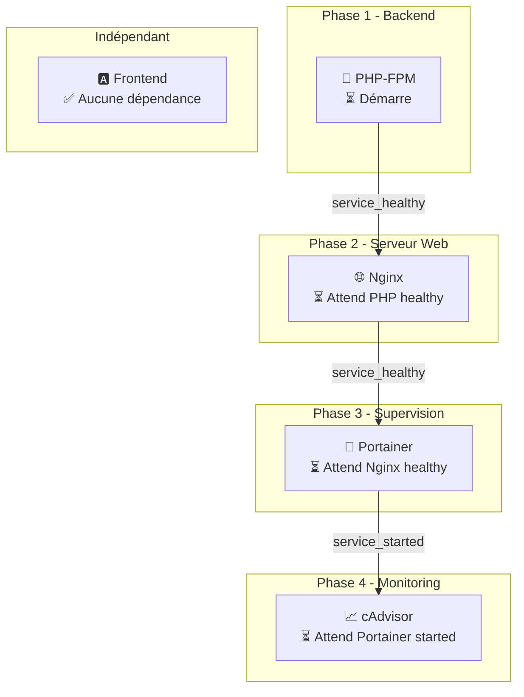
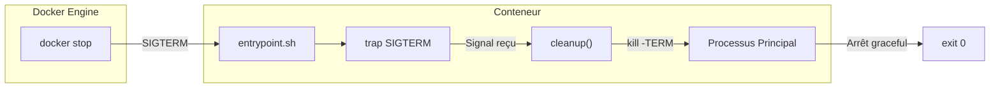
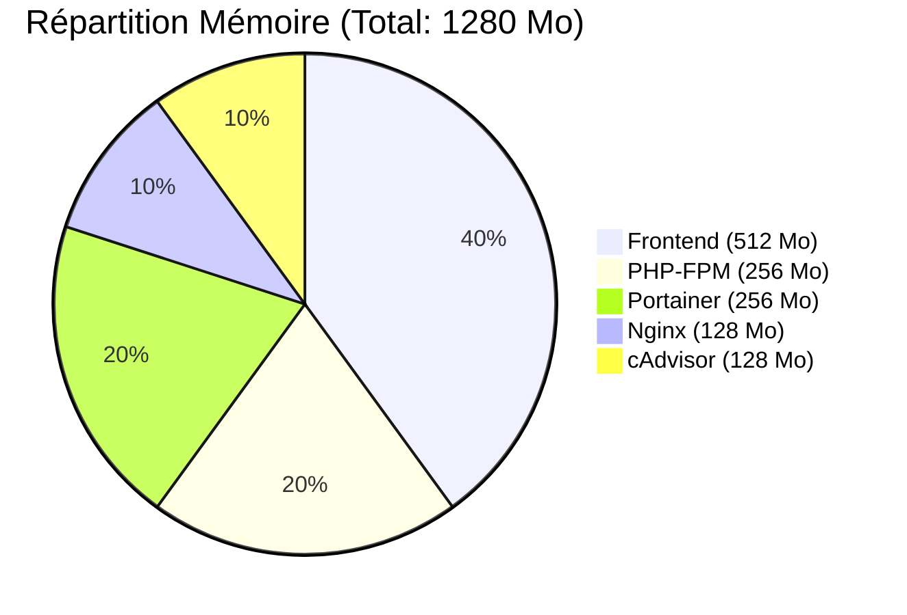
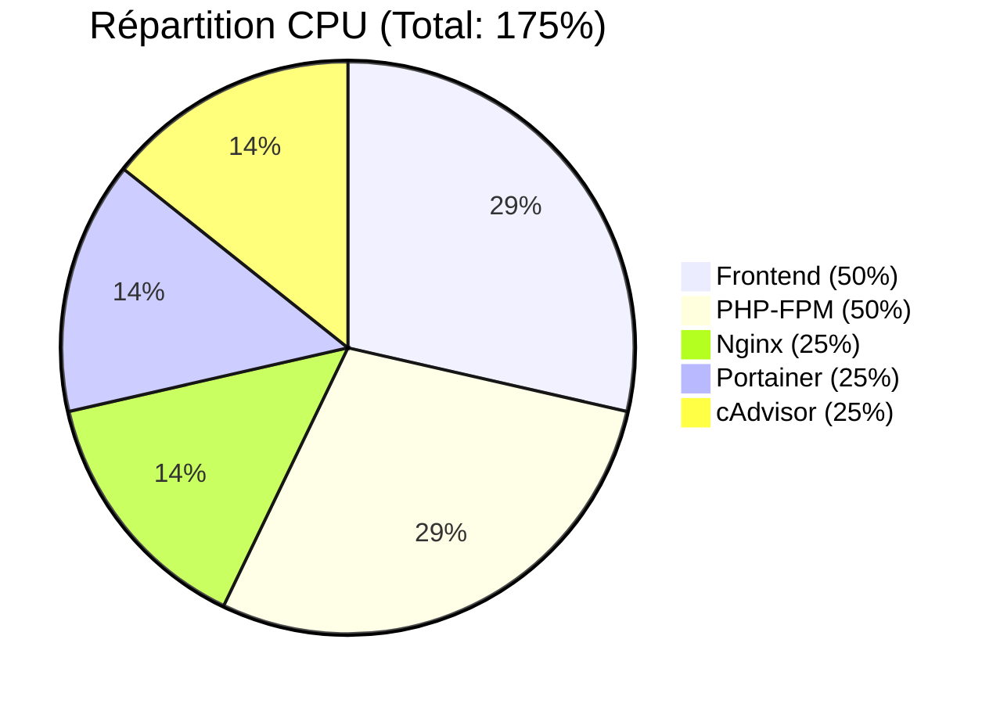
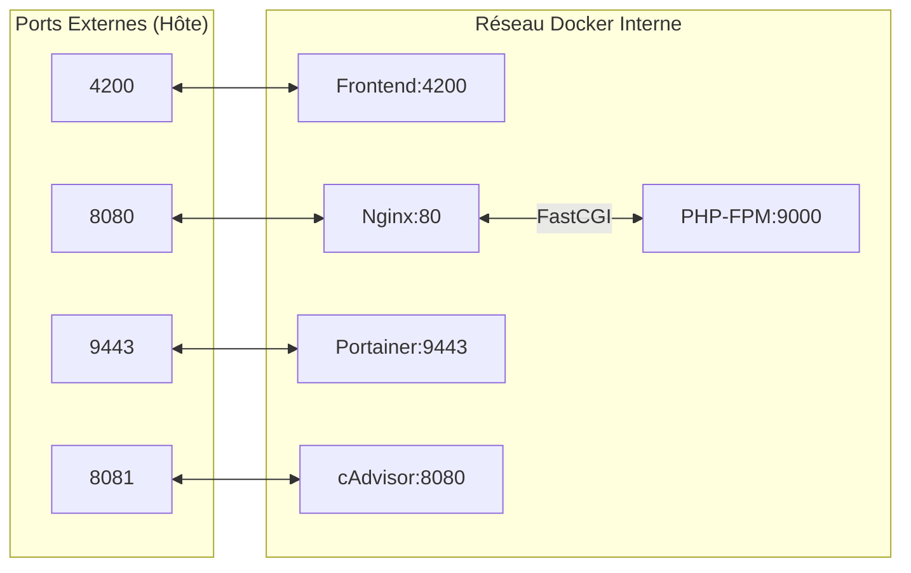

# 📊 Schéma d'Architecture - DevForDocker

Ce document présente les schémas d'architecture du projet au format Mermaid (compatible GitHub, GitLab, etc.).

## Architecture Globale

## Flux de Requêtes HTTP

## Ordre de Démarrage

## Gestion des Signaux

## Ressources Allouées

## Communication Inter-Services

---

## Visualisation

Pour visualiser ces schémas :

1. **GitHub/GitLab** : Les diagrammes Mermaid sont rendus automatiquement
2. **VS Code** : Installer l'extension "Markdown Preview Mermaid Support"
3. **En ligne** : Utiliser [Mermaid Live Editor](https://mermaid.live/)

---

*Schémas générés pour le projet DevForDocker - Février 2026*
