# 📊 Schéma d'Architecture - DevForDocker

Ce document présente les schémas d'architecture du projet au format Mermaid (compatible GitHub, GitLab, etc.).

## Architecture Globale

```mermaid
flowchart TB
    subgraph Internet["🌐 Internet / Client"]
        Client[("👤 Utilisateur")]
    end

    subgraph Host["🖥️ Hôte Docker"]
        subgraph Network["📡 Réseau: app-network (bridge)"]
            
            subgraph Frontend["Frontend"]
                FE["🅰️ Angular<br/>Port: 4200<br/>http-server"]
            end
            
            subgraph Backend["Backend Stack"]
                NGINX["🌐 Nginx<br/>Port: 8080→80<br/>Reverse Proxy"]
                PHP["🐘 PHP-FPM<br/>Port: 9000<br/>FastCGI"]
            end
            
            subgraph Monitoring["Outils de Supervision"]
                PORT["🔧 Portainer<br/>Port: 9443<br/>HTTPS"]
                CAD["📈 cAdvisor<br/>Port: 8081<br/>Métriques"]
            end
        end
        
        subgraph Volumes["💾 Volumes"]
            VOL1[("portainer_data")]
            VOL2[("./backend/src")]
        end
        
        SOCK["/var/run/docker.sock"]
    end

    Client -->|":4200"| FE
    Client -->|":8080"| NGINX
    Client -->|":9443"| PORT
    Client -->|":8081"| CAD
    
    NGINX -->|"FastCGI :9000"| PHP
    
    PHP -.->|"mount"| VOL2
    NGINX -.->|"mount"| VOL2
    
    PORT -.->|"mount"| VOL1
    PORT -.->|"socket"| SOCK
    CAD -.->|"socket"| SOCK
```

## Flux de Requêtes HTTP

```mermaid
sequenceDiagram
    participant C as 👤 Client
    participant N as 🌐 Nginx
    participant P as 🐘 PHP-FPM
    participant F as 📁 Fichiers

    C->>N: GET /index.php (port 8080)
    N->>N: Route vers PHP
    N->>P: FastCGI (port 9000)
    P->>F: Lecture /var/www/html/index.php
    F-->>P: Contenu PHP
    P->>P: Exécution PHP
    P-->>N: Réponse HTML
    N-->>C: HTTP 200 + HTML
```

## Ordre de Démarrage

```mermaid
flowchart TD
    subgraph Phase1["Phase 1 - Backend"]
        PHP["🐘 PHP-FPM<br/>⏳ Démarre"]
    end
    
    subgraph Phase2["Phase 2 - Serveur Web"]
        NGINX["🌐 Nginx<br/>⏳ Attend PHP healthy"]
    end
    
    subgraph Phase3["Phase 3 - Supervision"]
        PORT["🔧 Portainer<br/>⏳ Attend Nginx healthy"]
    end
    
    subgraph Phase4["Phase 4 - Monitoring"]
        CAD["📈 cAdvisor<br/>⏳ Attend Portainer started"]
    end
    
    subgraph Independent["Indépendant"]
        FE["🅰️ Frontend<br/>✅ Aucune dépendance"]
    end
    
    PHP -->|"service_healthy"| NGINX
    NGINX -->|"service_healthy"| PORT
    PORT -->|"service_started"| CAD
```

## Gestion des Signaux

```mermaid
flowchart LR
    subgraph Docker["Docker Engine"]
        STOP["docker stop"]
    end
    
    subgraph Container["Conteneur"]
        EP["entrypoint.sh"]
        TRAP["trap SIGTERM"]
        PROC["Processus Principal"]
        CLEAN["cleanup()"]
    end
    
    STOP -->|"SIGTERM"| EP
    EP --> TRAP
    TRAP -->|"Signal reçu"| CLEAN
    CLEAN -->|"kill -TERM"| PROC
    PROC -->|"Arrêt graceful"| EXIT["exit 0"]
```

## Ressources Allouées

```mermaid
pie title Répartition Mémoire (Total: 1280 Mo)
    "Frontend (512 Mo)" : 512
    "PHP-FPM (256 Mo)" : 256
    "Portainer (256 Mo)" : 256
    "Nginx (128 Mo)" : 128
    "cAdvisor (128 Mo)" : 128
```

```mermaid
pie title Répartition CPU (Total: 175%)
    "Frontend (50%)" : 50
    "PHP-FPM (50%)" : 50
    "Nginx (25%)" : 25
    "Portainer (25%)" : 25
    "cAdvisor (25%)" : 25
```

## Communication Inter-Services

```mermaid
flowchart LR
    subgraph Externe["Ports Externes (Hôte)"]
        E1["4200"]
        E2["8080"]
        E3["9443"]
        E4["8081"]
    end
    
    subgraph Interne["Réseau Docker Interne"]
        FE["Frontend:4200"]
        NG["Nginx:80"]
        PH["PHP-FPM:9000"]
        PO["Portainer:9443"]
        CA["cAdvisor:8080"]
    end
    
    E1 <--> FE
    E2 <--> NG
    E3 <--> PO
    E4 <--> CA
    
    NG <-->|"FastCGI"| PH
```

---

## Visualisation

Pour visualiser ces schémas :

1. **GitHub/GitLab** : Les diagrammes Mermaid sont rendus automatiquement
2. **VS Code** : Installer l'extension "Markdown Preview Mermaid Support"
3. **En ligne** : Utiliser [Mermaid Live Editor](https://mermaid.live/)

---

*Schémas générés pour le projet DevForDocker - Février 2026*
