# 📊 Schéma d'Architecture - DevForDocker

Ce document présente les schémas d'architecture du projet au format Mermaid (compatible GitHub, GitLab, etc.).

---

## Choix d'Architecture

### Pourquoi cette stack ?

| Composant | Choix | Alternatives possibles | Justification |
|-----------|-------|----------------------|---------------|
| **Frontend** | Angular + http-server | React, Vue, nginx | Angular CLI pour le build, http-server léger pour servir |
| **Backend** | PHP-FPM | Node.js, Python | PHP reste très répandu, FPM est performant |
| **Serveur Web** | Nginx | Apache, Caddy | Nginx excelle en reverse proxy et performance |
| **Supervision** | Portainer | Rancher, Kubernetes Dashboard | Léger et adapté pour Docker standalone |
| **Monitoring** | cAdvisor | Prometheus seul, Grafana | Métriques Docker natives, interface web incluse |

### Pourquoi Ubuntu 24.04 comme base ?

- **LTS (Long Term Support)** : Support jusqu'en 2029
- **Packages récents** : PHP 8.3, Nginx 1.24+ inclus nativement
- **Compatibilité** : Large écosystème de packages apt
- **Respect de la contrainte** : Pas d'images prêtes à l'emploi depuis Docker Hub

---

## Architecture Globale

```mermaid
flowchart TB
    subgraph Internet["🌐 Internet / Client"]
        Client[("👤 Utilisateur")]
    end

    subgraph Host["🖥️ Hôte Docker"]
        subgraph Network["📡 Réseau: app-network (bridge)"]
            
            subgraph Frontend["Frontend"]
                FE["🅰️ Angular<br/>Port: 4200<br/>http-server"]
            end
            
            subgraph Backend["Backend Stack"]
                NGINX["🌐 Nginx<br/>Port: 8080→80<br/>Reverse Proxy"]
                PHP["🐘 PHP-FPM<br/>Port: 9000<br/>FastCGI"]
            end
            
            subgraph Monitoring["Outils de Supervision"]
                PORT["🔧 Portainer<br/>Port: 9443<br/>HTTPS"]
                CAD["📈 cAdvisor<br/>Port: 8081<br/>Métriques"]
            end
        end
        
        subgraph Volumes["💾 Volumes"]
            VOL1[("portainer_data")]
            VOL2[("./backend/src")]
        end
        
        SOCK["/var/run/docker.sock"]
    end

    Client -->|":4200"| FE
    Client -->|":8080"| NGINX
    Client -->|":9443"| PORT
    Client -->|":8081"| CAD
    
    NGINX -->|"FastCGI :9000"| PHP
    
    PHP -.->|"mount"| VOL2
    NGINX -.->|"mount"| VOL2
    
    PORT -.->|"mount"| VOL1
    PORT -.->|"socket"| SOCK
    CAD -.->|"socket"| SOCK
```

## Flux de Requêtes HTTP

```mermaid
sequenceDiagram
    participant C as 👤 Client
    participant N as 🌐 Nginx
    participant P as 🐘 PHP-FPM
    participant F as 📁 Fichiers

    C->>N: GET /index.php (port 8080)
    N->>N: Route vers PHP
    N->>P: FastCGI (port 9000)
    P->>F: Lecture /var/www/html/index.php
    F-->>P: Contenu PHP
    P->>P: Exécution PHP
    P-->>N: Réponse HTML
    N-->>C: HTTP 200 + HTML
```

## Ordre de Démarrage

```mermaid
flowchart TD
    subgraph Phase1["Phase 1 - Backend"]
        PHP["🐘 PHP-FPM<br/>⏳ Démarre"]
    end
    
    subgraph Phase2["Phase 2 - Serveur Web"]
        NGINX["🌐 Nginx<br/>⏳ Attend PHP healthy"]
    end
    
    subgraph Phase3["Phase 3 - Supervision"]
        PORT["🔧 Portainer<br/>⏳ Attend Nginx healthy"]
    end
    
    subgraph Phase4["Phase 4 - Monitoring"]
        CAD["📈 cAdvisor<br/>⏳ Attend Portainer started"]
    end
    
    subgraph Independent["Indépendant"]
        FE["🅰️ Frontend<br/>✅ Aucune dépendance"]
    end
    
    PHP -->|"service_healthy"| NGINX
    NGINX -->|"service_healthy"| PORT
    PORT -->|"service_started"| CAD
```

## Gestion des Signaux

```mermaid
flowchart LR
    subgraph Docker["Docker Engine"]
        STOP["docker stop"]
    end
    
    subgraph Container["Conteneur"]
        EP["entrypoint.sh<br/>exec $@"]
        PROC["Processus Principal<br/>(PID 1)"]
    end
    
    STOP -->|"STOPSIGNAL<br/>(SIGTERM ou SIGQUIT)"| EP
    EP -->|"exec remplace<br/>le shell"| PROC
    PROC -->|"Gestion native<br/>du signal"| EXIT["Arrêt propre"]
```

### Stratégie par Service

```mermaid
flowchart TB
    subgraph Frontend["Frontend (http-server)"]
        F1["STOPSIGNAL: SIGTERM"]
        F2["Node.js gère nativement"]
        F3["Arrêt immédiat"]
        F1 --> F2 --> F3
    end
    
    subgraph Backend["Backend (PHP-FPM)"]
        B1["STOPSIGNAL: SIGQUIT"]
        B2["PHP-FPM termine<br/>les requêtes en cours"]
        B3["Arrêt graceful"]
        B1 --> B2 --> B3
    end
    
    subgraph Web["Serveur Web (Nginx)"]
        W1["STOPSIGNAL: SIGQUIT"]
        W2["Nginx termine<br/>les connexions actives"]
        W3["Arrêt graceful"]
        W1 --> W2 --> W3
    end
```

| Service | Signal | Type d'arrêt | Gestion |
|---------|--------|--------------|---------|
| Frontend | SIGTERM | Immédiat | Native (Node.js) |
| PHP-FPM | SIGQUIT | Graceful | Native (PHP-FPM) |
| Nginx | SIGQUIT | Graceful | Native (Nginx) |
| Portainer | SIGTERM | Standard | Native (Go) |
| cAdvisor | SIGTERM | Standard | Native (Go) |

## Ressources Allouées

### Limites Mémoire

### Limites CPU

> **Note** : Les valeurs `cpus` représentent une fraction d'un core CPU par conteneur.
> Ce ne sont **pas des pourcentages du CPU total**, mais des limites individuelles.
> Exemple : `cpus: 0.5` = le conteneur peut utiliser 50% d'**un** core CPU.

| Service | Limite CPU | Signification |
|---------|-----------|---------------|
| Frontend | `0.5` | Peut utiliser 50% d'un core |
| PHP-FPM | `0.5` | Peut utiliser 50% d'un core |
| Nginx | `0.25` | Peut utiliser 25% d'un core |
| Portainer | `0.25` | Peut utiliser 25% d'un core |
| cAdvisor | `0.25` | Peut utiliser 25% d'un core |

## Communication Inter-Services

```mermaid
flowchart LR
    subgraph Externe["Ports Externes (Hôte)"]
        E1["4200"]
        E2["8080"]
        E3["9443"]
        E4["8081"]
    end
    
    subgraph Interne["Réseau Docker Interne"]
        FE["Frontend:4200"]
        NG["Nginx:80"]
        PH["PHP-FPM:9000"]
        PO["Portainer:9443"]
        CA["cAdvisor:8080"]
    end
    
    E1 <--> FE
    E2 <--> NG
    E3 <--> PO
    E4 <--> CA
    
    NG <-->|"FastCGI"| PH
```

---

## Visualisation

Pour visualiser ces schémas :

1. **GitHub/GitLab** : Les diagrammes Mermaid sont rendus automatiquement
2. **VS Code** : Installer l'extension "Markdown Preview Mermaid Support"
3. **En ligne** : Utiliser [Mermaid Live Editor](https://mermaid.live/)

---

*Schémas générés pour le projet DevForDocker - Février 2026*
